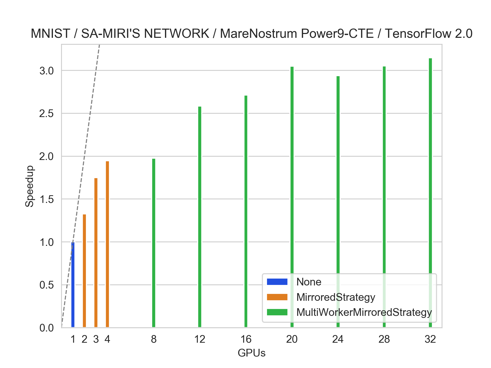
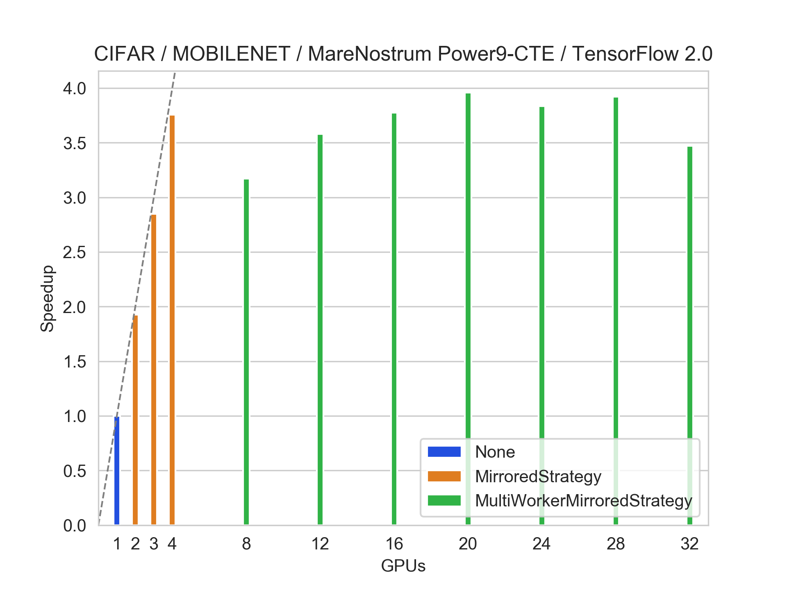

## How to run training using `SLURM`
Before running training please adjust `checkpoint_dir` variable.
- SA-MIRI's network:
```bash
sbatch job_cte_nostrategy.sh --architecture sa_miri --epochs 20 --batch_size 128
```
```bash
sbatch job_cte_mirroredstrategy.sh --architecture sa_miri --epochs 20 --batch_size 128
```
```bash
sbatch job_cte_multiworkermirroredstrategy.sh --architecture sa_miri --epochs 20 --batch_size 128
```

- MobileNet:
```bash
sbatch job_cte_nostrategy.sh --architecture mobilenet --epochs 5 --batch_size 128
```
```bash
sbatch job_cte_mirroredstrategy.sh --architecture mobilenet --epochs 5 --batch_size 128
```
```bash
sbatch job_cte_multiworkermirroredstrategy.sh --architecture mobilenet --epochs 5 --batch_size 128
```

- Resnet101:
```bash
sbatch job_cte_nostrategy.sh --architecture resnet101 --epochs 5 --batch_size 64
```
```bash
sbatch job_cte_mirroredstrategy.sh --architecture resnet101 --epochs 5 --batch_size 64
```
```bash
sbatch job_cte_multiworkermirroredstrategy.sh --architecture resnet101 --epochs 5 --batch_size 64
```

## Results
Evaluations made intra-node (using 2-4 GPUs) were using `NCCLAllReduce`, evaluations made inter-node (using 8+ GPUs) were using `RING` collective communication.
- SA-MIRI's network:

- MobileNet:

- Resnet101:


## Future work
It would be interesting to measure speedup for `MultiWorkerMirroredStrategy` with `NCCL` set as collective communication mechanism.